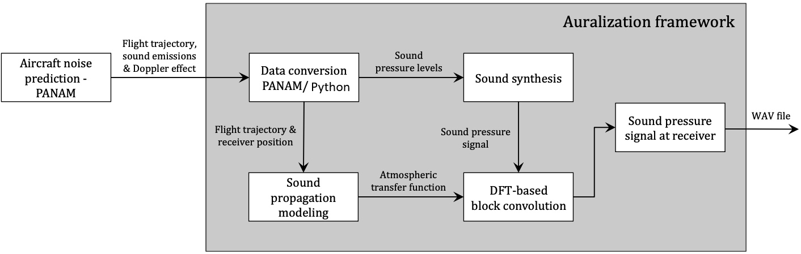
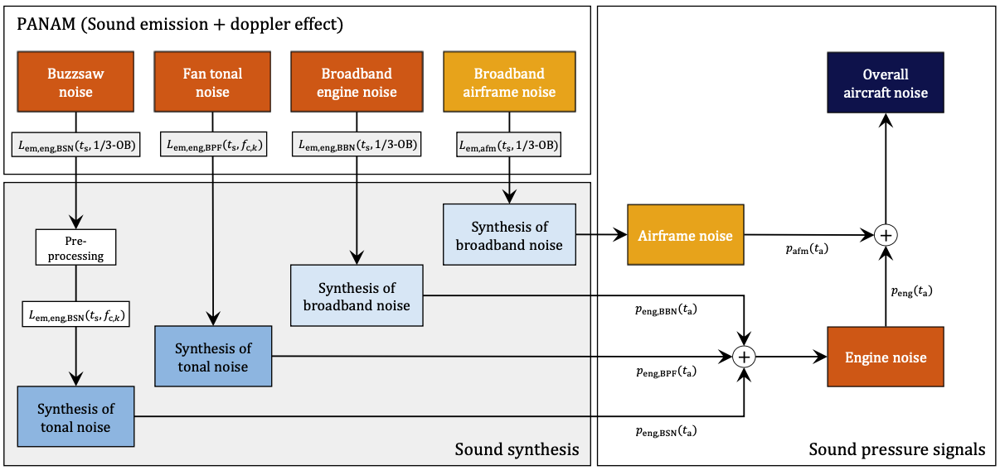
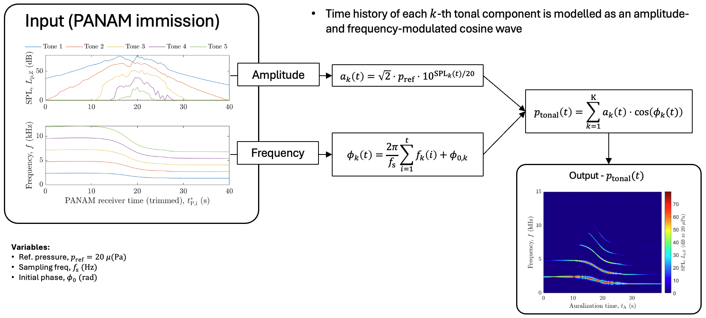

# Python Auralization Framework for Environmental Aircraft Noise

This repository contains an **open-source Python implementation** of an aircraft-noise auralization workflow for **environmental sound quality analysis**.

This work should be understood clearly as a **translation and open-source redevelopment** of a previously developed **MATLAB-based framework**, originally developed in the context of the PhD thesis:

**Gil Felix Greco**  
*Sound quality analysis of environmental aircraft noise: framework development & applications*

The present Python implementation was developed by **Ricardo Rocha** as part of the transition from a **non-open-source MATLAB framework** to a **fully open-source Python framework**, under a grant from **Open Science Delft**, and under the supervision of **Dr. R. Merino-Martínez (TU Delft)**. This repository does not introduce a completely new auralization methodology from scratch. Its main purpose is to:

- translate the existing Gil's MATLAB workflow into Python
- preserve the original methodological structure as faithfully as possible
- provide a transparent and fully open-source implementation for future research and development

---
## Workflow figures

### Overall auralization framework 

 

*Figure 1. Schematic flowchart summarizing the main processes used in the auralization framework. Adapted from Fig. 3.9 in Gil Felix Greco, **Sound quality analysis of environmental aircraft noise: framework development & applications**, PhD thesis, 2025.*

### Sound synthesis procedure 

 

*Figure 2. Schematic flowchart of the sound synthesis procedure used to transform the aircraft noise predictions provided by PANAM into sound pressure signals. Adapted from Fig. 3.2 in Gil Felix Greco, **Sound quality analysis of environmental aircraft noise: framework development & applications**, PhD thesis, 2025.* 

### Tonal-component workflow 

 

*Figure 3. Tonal-component auralization workflow. Adapted from presentation slides by Gil Felix Greco, “Sound quality assessment of SIAM aircraft”, Technische Universität Braunschweig.* 

---

## Overview

The framework synthesizes environmental aircraft flyover sound by combining:

- **Tonal noise**
  - fan harmonics
  - buzz-saw noise
- **Broadband noise**
  - engine broadband noise
  - airframe broadband noise

The overall workflow consists of:

1. **Data conversion / preprocessing**
   - source-model output is read and organized
   - tonal and broadband components are extracted
   - the relevant flyover segment is trimmed

2. **Signal synthesis**
   - tonal components are synthesized as amplitude- and frequency-modulated cosine waves
   - broadband components are synthesized from band-based source information

3. **Propagation**
   - atmospheric and ground propagation effects are intended to be modelled
   - this part is **still under development** in Python (more on this underneath*)

4. **Auralization output**
   - time-domain flyover signal
   - intermediate plots and verification outputs
   - final propagated sound output once the propagation chain is completed

### Still under development

*The **propagation stage is still being developed**.

The long-term goal is to integrate a proper Python interface for **ART (Atmospheric Ray Tracing)** so that atmospheric and ground propagation can be modelled consistently in a fully open-source workflow.

This development is based on:

- **Philipp Schäfer & Michael Vorländer (2021)**  
  *Atmospheric Ray Tracing: An efficient, open-source framework for finding eigenrays in a stratified, moving medium*,  
  *Acta Acustica*, 5, 26.  
  https://doi.org/10.1051/aacus/2021018

- Virtual Acoustics ART project page:  
  https://www.virtualacoustics.org/GA/art/#download

At the current stage, propagation is **not yet fully completed** in the Python version.

---
## Installation and usage 

### 1. Clone the repository 

```bash 
git clone <https://github.com/PALILA-TUDelft/Auralization-toolbox> cd <Auralization-toolbox>
``` 

### 2. Create a virtual environment 

#### Windows 

```bash 
python -m venv .venv .venv\Scripts\activate
``` 

#### macOS / Linux

```bash 
python3 -m venv .venv source .venv/bin/activate
``` 

### 3. Install dependencies 

```bash 
pip install --upgrade pip pip install -r requirements.txt
``` 

### 4. Repository setup 

The project includes a `setup_environment.py` script that appends the main project folders to the Python path, namely the repository root, `auralization/`, and `utilities/`. It also still contains some legacy references to third-party and MATLAB-era folders. In most cases, you do not need to run this manually, because the main workflow already calls `setup_paths()` at startup. 

### 5. Prepare the input data 

The current workflow expects an input directory containing at least: 

- one `.ini` configuration file
- `auralization_input.dat`
- `geschw_hoehe_verlauf.dat`

By default, `main.py` searches the selected input folder for exactly one `.ini` file. If none is found, the run fails; if more than one is found, the script asks for one to be specified explicitly. The same workflow then reads `auralization_input.dat` as the source-model input and `geschw_hoehe_verlauf.dat` as the flight-profile input. A typical folder layout is therefore: 

```text
input_data/
├── case.ini
├── auralization_input.dat
└── geschw_hoehe_verlauf.dat
```


### 6. Run the code 

The simplest way to run the current workflow is:

```bash 
python main.py
``` 

This runs: 

```python 
auralization_main("input_data")
``` 

from the repository root, so the default expectation is that your input files are stored in a folder called `input_data/`. The main workflow sets up paths, reads the configuration, loads source data, loads the flight profile, trims the relevant segment, and then calls the core auralization routine. 

You can also run it manually from Python: 

```python
from main import auralization_main

auralization_main("input_data")
```

If your input folder has a different name or location, pass that path explicitly:

```python
from main import auralization_main

auralization_main("path/to/your/input_folder")
```

### 7. What the code currently does 

At the current stage, the main workflow performs the following steps: 

1. set up the environment paths
2.  read the `.ini` configuration
3. load the source-model data
4. determine the number of receivers
5. create results folders
6. load the flight profile
7. trim the input data around the relevant flyover segment
8. synthesize the tonal and broadband components
9. call the propagation stage structure

The trimming is performed around the closest source-receiver distance using a user-defined trimming window, and duplicate time steps are removed before synthesis. The tonal stage synthesizes both fan harmonics and buzz-saw noise, while the broadband stage synthesizes engine and airframe broadband noise separately before combining them into a total signal. 

### 8. Main parameters to tune

The most important user-adjustable parameters currently visible in the code are the following. 

#### In the `.ini` file 

- `sampling_freq`: sets the output sampling frequency `fs`. If not provided, the code falls back to `48000`.
- `trim_time`: sets how many seconds before and after the closest-approach region are kept during trimming. If not provided, the code falls back to `20`.
- `smoothings_emission_based`: controls the smoothing used during broadband synthesis when converting band-based data into narrowband content. If not provided, the code falls back to `0`.
- `max_rotations_per_minute`: used in the buzz-saw tonal reconstruction to derive the harmonic base frequency.
- `n_harmonics`: sets the number of synthesized harmonics for the buzz-saw component.

There are also propagation-related parameters already read by the propagation module, including: 
- `temperature_celsius`
- `temperature_profile`
- `const_rel_humidity`
- `const_static_pressure`
- `sigma_e`

These are used to build the atmospheric configuration and ground-reflection settings, although the full propagation chain is still under development.

#### In `main.py`
A few runtime switches are currently set directly inside `main.py`, including: 
- `show_flight_profile`: show the flight-profile visualization.
- `flight_profile_save_fig`: save the flight-profile figure to disk.
- `show_auralization`: show synthesis/auralization plots such as spectrograms.
- `save_figs`: enable tagged figure export for receiver-specific outputs.
- `flight_procedure`: select the flight-profile case (`0=approach`, `1=departure`, `2=flyover`).
  
At present, `flight_procedure` is set to `2`, corresponding to a flyover case.

---
## Repository structure

```text
.
├── README.md
├── requirements.txt
├── globals.py
├── setup_environment.py
├── main.py
├── auralization/
│   ├── master_auralization_engine_airframe.py
│   └── private/
│       ├── get_auralization_time.py
│       ├── get_tonal_input.py
│       ├── tonal_synthesis.py
│       ├── broadband_synthesis_smooth.py
│       ├── convert_freq_bands.py
│       └── propagation/
│           ├── get_propagation.py
│           ├── atmosphere.py
│           ├── ground_reflection.py
│           ├── angles.py
│           ├── tf_model.py
│           └── art_bindings.py
├── utilities/
│   ├── prepare_input_SQ.py
│   ├── trim_data_time_distance_based.py
│   ├── plot_utils.py
│   ├── io.py
│   ├── ini_parser.py
│   ├── flight_profile_utils.py
│   └── create_results_folder.py
├── docs/
│   └── images/
│       ├── workflow_overview.png
│       └── workflow_tonal_component.png
├── input_data/
└── verification/
```
---

## File overview 
### Root-level files 
- `README.md`: Main repository documentation, including project context, installation, usage, and repository structure.
- `requirements.txt`: Lists the Python dependencies required to run the current implementation.
- `globals.py`: Stores shared global configuration variables used across the auralization workflow, such as the sampling frequency, PANAM time step, input configuration dictionary, and acoustic reference pressure.
- `setup_environment.py`: Sets up the Python path for the repository by appending the root folder and key subfolders such as `auralization/` and `utilities/`. It also still contains some legacy path references from the MATLAB-to-Python transition.
- `main.py`: Main entry point of the workflow. It loads the input configuration, reads the source-model and flight-profile data, prepares trimmed receiver-specific inputs, creates results folders, and calls the main auralization engine for each receiver.

### `auralization/` 
- `master_auralization_engine_airframe.py`: Core orchestration function for the source-synthesis stage. It constructs the auralization time vectors, synthesizes tonal fan harmonics and buzz-saw noise, synthesizes broadband engine and airframe noise, combines these components into engine and overall signals, and then calls the propagation stage. This mirrors the structure of the original MATLAB implementation closely. 

### `auralization/private/`
- `get_auralization_time.py`: Generates the time vectors needed for the auralization process, including the PANAM-based source time and the higher-resolution synthesis time vector.
- `get_tonal_input.py`: Prepares the tonal input data for synthesis. For fan harmonics, it reads the directly available tonal content; for buzz-saw noise, it reconstructs harmonic trajectories from engine rotational speed, Doppler shift, and third-octave-band source content. 
- `tonal_synthesis.py`: Synthesizes tonal signals from time-varying SPL and frequency trajectories. It interpolates tonal envelopes to the auralization time base, converts SPL to pressure amplitude, generates the tonal waveform, and optionally plots the resulting spectrogram. 
- `broadband_synthesis_smooth.py`: Synthesizes broadband noise in the time domain from band-based source data. It converts spectral bands into narrowband bins, applies overlap-add style block synthesis, and generates broadband engine or airframe signals. 
- `convert_freq_bands.py`: Helper routine used during broadband synthesis to convert band-based source information into a narrowband spectral representation suitable for time-domain reconstruction. 

### `auralization/private/propagation/` 
- `get_propagation.py`: Main propagation driver. It reads atmospheric and ground parameters from the input configuration, generates the frequency vector, queries ART eigenrays, computes propagation times, and assembles propagation-related transfer-function outputs.
- `atmosphere.py`: Defines the atmospheric configuration and atmosphere model used by the propagation stage.
- `ground_reflection.py`: Contains the ground-reflection coefficient model used in the propagation calculations. 
- `angles.py`: Provides angular post-processing utilities, including angle conversion for binaural/HRTF-related propagation outputs. 
- `tf_model.py`: Builds the transfer-function representation used to apply propagation effects in the frequency domain. 
- `art_bindings.py`: Intended Python interface to the ART (Atmospheric Ray Tracing) backend for eigenray computation. This file is part of the ongoing propagation migration and development. 
- ### `utilities/`
- `prepare_input_SQ.py`: Prepares receiver-specific input for synthesis. It removes duplicate timestamps, trims the source and spectrogram data around the relevant flyover window, and trims the corresponding flight-profile data consistently. 
- `trim_data_time_distance_based.py`: Helper function used to determine the trimming interval based on source-receiver distance and a user-defined trimming time window.
- `plot_utils.py`: Plotting utilities used across the workflow, including spectrogram plotting and some diagnostic comparison plots for synthesis verification.
- `io.py`: Handles file I/O tasks, including conversion of PANAM/SQAT-style source data into the internal Python data structures used by the workflow. - `ini_parser.py` Parses the `.ini` configuration file and makes the input parameters accessible to the rest of the workflow.
- `flight_profile_utils.py`: Reads and processes the flight-profile input and supports optional visualization and figure saving.
- `create_results_folder.py`: Creates the output folder structure used to store results for each receiver and for the case as a whole.

### Other folders
- `input_data/`: Expected location for case-specific input files such as the `.ini` configuration, the source-model data file, and the flight-profile file. 
- `verification/`: Stores intermediate outputs and comparison files used to verify the Python implementation against the original MATLAB workflow.
- `docs/images/`

## Contact

If you have questions about the repository, need help using the framework, or would like to suggest improvements, please feel free to get in touch:

- Ricardo Rocha — rmoraisdarocha@tudelft.nl
- Dr. R. Merino-Martínez — R.MerinoMartinez@tudelft.nl

For bug reports, suggestions, or contributions, opening an issue in the repository is also encouraged. Thank you!
